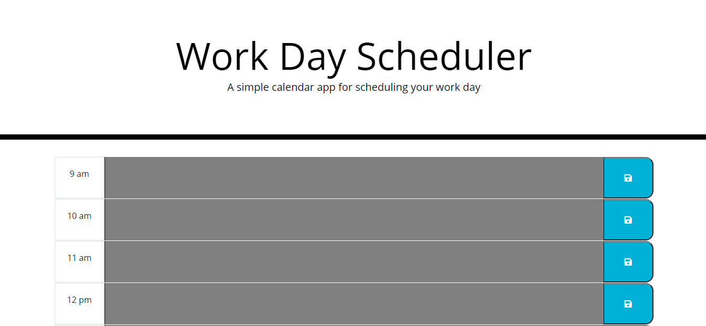

# Day-Planner

This application is used plan a daily work schedule.

## Usage

Link to the application: https://patrbraun.github.io/Day-Planner/

When you load the page any previously saved data will automatically populate.

Click in the appropriate text field and enter your data for the hour. Then click that row's save button to save your entry.

Emptying the text box and saving it will delete the entry in storage.
